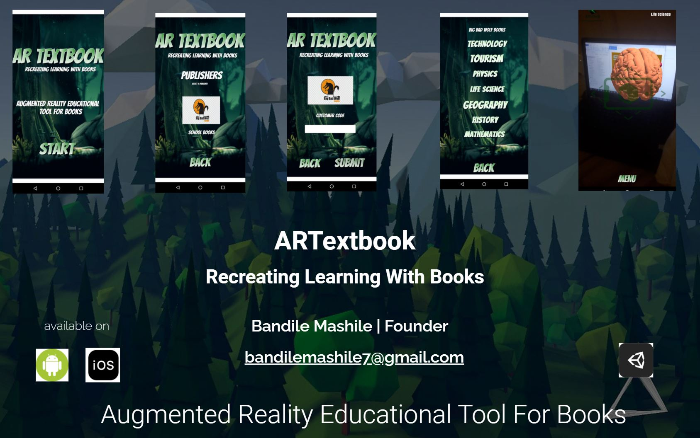

# artextbook-demo
ARTextbook is a augmented reality tool for books that helps to explain concepts in books in more detail as supposed to the traditional methods of learning. ARTextbook enables publishers to have 3d immersive experiences implemented to their books to also help the traditional book publishing industry inherit a new technology that can be use to educate more effectively 

Apk is in zip folder

